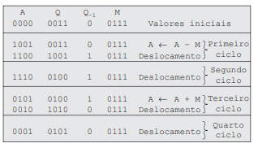
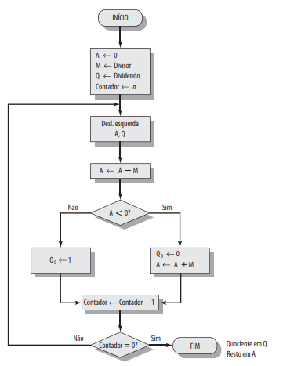
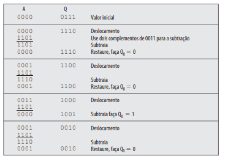

```
Em andamento.
```

# Arquitetura de computadores

## Problemas

Uma introdução ao IAS está no meu projeto [J](https://github.com/SapoGitHub/Repositorio-Geral/tree/master/J).

Estes são alguns problemas retirados do livro de Arquitetura e Organização de Computadores (8 edição, William Stallings).

### Problema 2.1

Considere que A = A(1), A(2),... , A(1 000) e B = B(1), B(2),..., B(1 000) sejam dois vetores (arrays unidimensionais) compostos de 3 números em cada um, que são somados para formar um array C tal que C(I) = A(I) + B(I) para I = 1,2,3. Usando o conjunto de instruções do IAS, escreva um programa para esse problema. 

[Código](https://github.com/SapoGitHub/Repositorio-Geral/blob/master/Arquitetura/Problema%202.1.asm) em linguagem de montagem.

## Problema 2.4

Interprete e escreva em linguagem de montagem:
```
08A 010FA210FB
08B 010FA0F08D
08C 020FA210FB
```

Reescrevendo de forma mais legível:
```
08A [01 0FA] [21 0FB]
08B [01 0FA] [0F 08D]
08C [02 0FA] [21 0FB]
```
Então para a primeira linha guarda seu conteúdo no endereço 08A Hex (138 Dec). Seu conteúdo tem 2 palavras:
1. [01 0FA]
2. [21 0FB]

A primeira palavra, traz um opcode e um endereço:
1. 01 Hex (1 Dec, 0000 0001 Bin): Load M(X): transfere o conteúdo de X para o AC
2. 0FA Hex (250 Dec): Endereço de memória.

Podemos reescrever então como [01 0FA]=LOAD M(0FA). De forma análoga, temos para a segunda palavra 21 Hex(33 Dec, 00010 0001 Bin). Esse opcode é STOR M(X), que implica em transferir o conteúdo de AC para X.

Então a primeira linha do código contém de forma descritiva:
- Copia o conteúdo de 0FA para AC, e depois de AC para 0FB.

Então fazendo o mesmo para as outras linhas, temos:
- Copia o conteúdo de 0FA para AC, e depois de AC para 0FB.
- Copia novamente o conteúdo de 0FA para AC e se o número for positivo, apanha a próxima instrução da metade esquerda de 08D.
- Então transferimos o valor de 0FA com o sinal invertido para AC e salvamos em 0FB.

Fizemos algumas mudanças:
- Declaramos um valor em 0FA (25 decimal);
- Substituímos os endereços 08A, 08B e 08C por 000, 001 e 08D respectivamente;
- Adicionamos um comando para pular para um endereço que não existe em 08E.

Então agora nosso código:
- Armazena o número 25 em 0FA;
- Copia 25 para o AC, e depois passa do AC para 0FB;
- Copia 25 novamente para o AC e como é positivo apanha a próxima instrução na metade esquerda de 08D;
- Salvamos 25 com sinal contrário (-25) em AC e do AC guardamos em 0FB;
- Buscamos a próxima instrução em um endereço inexistente (1024 em decimal) causando a interrupção do programa:

Temos o código em [linguagem de máquina](https://github.com/SapoGitHub/Repositorio-Geral/blob/master/Arquitetura/Problema%202.4.o) e [linguagem de montagem](https://github.com/SapoGitHub/Repositorio-Geral/blob/master/Arquitetura/Problema%202.4.asm).

## Algoritmo de Booth

### Adição

Primeiro precisamos definir como funciona a adição, já que uma multiplicação nada mais é que sucessivas adições.

A adição de inteiros em binário seguem algumas regras simples:
- 0+0=0;
- 0+1=1;
- 1+0=1;
- 1+1=0 (e 'vai 1' para o dígito de ordem superior);
- 1+1+1=1 (e 'vai 1' para o dígito de ordem superior).

**Overflow**: E temos uma regra simples para determinar a ocorrência de overflow: se os dois números somados tem o mesmo sinal, ocorre overflow se o resultado possuir o sinal oposto.
Agora 

### Subtração

**Negação**: o processo de obter o mesmo número com sinal invertido, por exemplo, fazendo a negação de 1, temos -1.

Na representação sinal-magnitude, a negação de um inteiro é só inverter o bit de sinal. Na notação de complemento de dois seguimos as seguintes regras:
1. Invertemos bit a bit o número:
	- Onde é 0, escrevemos 1;
	- Onde é 1, escrevemos 0;
2. Tratamos o resultado como um inteiro binário sem sinal, e somamos 1:

```
11101110 	-18 (decimal)
00010001 	
      +1
--------
00010010	+18 (decimal)
```

E então para realizarmos a subtração seguimos a seguinte regra: para subtrair um número (subtraendo) de outro (minuendo) apanhamos o complemento de dois (negação) do subtraendo e somamos ao minuendo.
Já que para diminuirmos B de A, somamos a negação de B a A: <code>A-B=A+(-B)</code>.

```
 0111	Minuendo	 0111
-0101	Subtranedo	+1011
-----   		-----
 0010	 		 0010
```


### Multiplicação

**Multiplicação de inteiros sem sinal**:

```
    1011	Multiplicando
  x 1101	Multiplicador
--------
    1011
   0000		Produtos
  1011		Parciais
 1011
--------
10001111	Produto
```

1. A multiplicação envolve a geração de produtos parciais, um para cada dígito no multiplicador, e eesses produtos parciais são então somados para produzir o produto final;
2. Os produtos parciais são fácilmente definidos segundo o bit multiplicador:
	- 0: o produto parcial e 0;
	- 1: o produto parcial é o multiplicando.
3. O produto total é produzido somando-se os produtos parciais;
	- Cada produto parcial sucesso é deslocado uma posição à esquerda em relação ao produto parcial anterior.
4. A multiplicação de dois inteiros binários de n bits resulta em um produto de até 2n bits.

Observações:
- Podemos realizar uma adição acumulada nos produtos parciais ao invés de esperar até o final.
- Para cada 1, uma operação de soma e deslocamento é necessária;
- Para cada 0, somente um deslocamento é necessário.

**Multiplicação por complemento de dois**

Não podemos considerar como inteiros sem sinal da mesma fora que fazemos com a adição, se o muliplicando ou multiplicador for negativo.


O algoritmo de Boot é descrito da seguinte forma:

- O multiplicador e o multiplicando são colocados nos registradores Q e M respectivamente;
- Temos um registrador de 1 bit colocado logicamente à direita do bit menos significativo do registrador Q, chamado C;
- Resultados aparecerão em A e Q;
- A e C são inicializados em 0; 

O código:
1. A, C, M e Q são inicializados.
2. Vamos verificar os bits do multiplicador um de cada vez;
	- Cada vez que cada bit é examinado, o bit à sua direita também é examinado.
3. Se os dois bits:
	- Forem iguais (1 e 1, 0 e 0) não fazemos nada;
	- Forem 0 e 1 então o multiplicando é somado ao registrador A;
	- Forem 1 e 0 então o multiplicando é subitraído do registrador A;
4. Então todos os bits dos registrados A,Q e C são deslocados à direita por 1 bit.
	- **Deslocamento aritmético**: O bit mais a esquerda de A é deslocado, e o novo bit é igual a ele.

*Atenção*: Os registrados são colocados logicamente na seguinte ordem: A,Q,C.

- Isso significa que por exemplo se termos <code>1001 0011 0</code> respectivamente,  quando deslocarmos a direita vamos ter: <code>1100 1001 1</code>. 
- E agora com <code>1100 1001 1</code> a comparação vai ser entre 1 e 1;
- Se o estado final for <code>0001 0101 0</code>, a resposta está em A e Q, então é <code>0001 0101</code>, ou em decimal 23.

Um exemplo de algoritmo de Boot (7x3) é:



Escrevemos um [código em python](booth.py) para isso. E escrevemos outro com [interface gráfica](https://github.com/SapoGitHub/Repositorio-Geral/blob/master/Arquitetura/booth%20-%20GUI.py).

## Divisão

Para divisão nos baseamos no seguinte fluxograma:



Que gera o seguinte exemplo de divisão (7/3):



Com as seguinte adaptações:
1. Se o divisor ou dividendo for negativo, pegamos o complemento.
2. Realizamos toda a divisão normalmente.
3. Atribuimos os sinais do quociente e resto de acordo com a seguinte regra:
	- sinal(resto)=sinal(dividendo)
	- sinal(quociente)=sinal(dividendo) x sinal(divisor)

**Observação**: Na operação 7/3=2*3+1:
- Dividendo: 7
- Divisor: 3
- Quociente: 2
- Resto: 1

Novamente também desenvolvemos um código [sem](https://github.com/SapoGitHub/Repositorio-Geral/blob/master/Arquitetura/divisao.py) e [com](https://github.com/SapoGitHub/Repositorio-Geral/blob/master/Arquitetura/divisao%20-%20GUI.py) interface gráfica.
