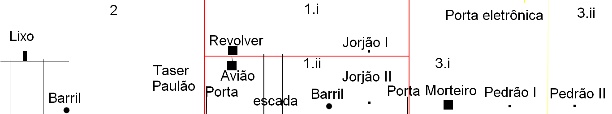
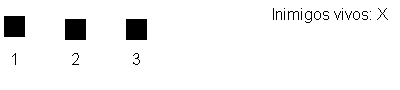

# GDD

A estrutura desse GDD é feita baseado no [GDD Maker](http://www.gddmaker.com/), e o jogo por sua vez, foi feito para uma [game jam](https://itch.io/jam/gmtk-2018) de 48h.

## Título e descrição

**Nome**:
Fantasminha CaArmado

**Descrição curta**:
Jogo desenvolvido para a game jam GM TK Game Jam 2018.

**Versão**: 1

## Visão geral

**Conceito**:
O jogo se baseia no desafio de produzir um jogo de um determinado gênero, sem uma das principais mecânicas deste tipo de gênero. Nesse caso foi escolhido um jogo de "tiro de plataforma", mas os tiros não acertam os inimigos. A ideia é que você é um fantasma armado que assombra uma instalação militar, mas não consegue interagir diretamente com os militares, portanto você precisa fazer uso do ambiente para eliminá-los. E essa interação por sua vez, é feita somente através de suas armas, pois você carrega os traumas de um veterano de guerra morto.

**Audiência**:
Jogadores casuais, e principalmente, participantes da Game Jam em questão.

**Resumo do fluxo**: A princípio, o jogo todo vai ter somente uma tela, um único ambiente. Quando você morre, esta tela e todos os elementos do jogo são simplesmente reiniciados.

**Aparência e clima**:
O visual todo do jogo é construído em cima <s>de uma mistura de visual pixelado como terraria e Metal Slug</s> do que pode ser encontrado livremente na internet.

## Gameplay

**Progressão**: Como o jogo todo é baseado em um único ambiente, não há uma progressão significativa que mereça destaque. A única medida que pode ser feita diretamente, é a quantidade de inimigos ainda vivos e proporção do mapa explorado.

**Missões**: A missão colocada é a de eliminar as forças militares que ocupam a base para reestabelecer a paz na região.

**Estrutura dos desafios**: Conforme o jogador avança, a ideia é que consiga eliminar os inimigos em que isso seja possível no momento, e colocar outros que não são possíveis no momento em uma situação mais favorável a você.

**Objetivos**: O objetivo do jogador, como previamente discutido é a de eliminar todos os indivíduos na base. Em poucas palavras: mate todos.

**Fluxo de jogo**: Para o jogador, temos apenas uma tela inicial, um único ambiente, onde conforme ele progride, vai conseguindo acesso a mais e mais partes do mapa para eliminar todos os militares.

## Mecânica

**Física**: A física na maior parte do tempo não existe. Não vai ser desenvolvido nenhum motor de física, na maior parte dos movimentos não vai seguir nenhuma física, apenas quando julgar necessário se baseará na física para realizar algum movimento de forma mais realista.

**Movimento no jogo**: O jogador se desloca pelo mapa do jogo através de seu personagem principal, isto é, controlando o seu avatar.

**Objetos**: Os únicos objetos que o jogador pode pegar são as armas, e elas são coletadas apenas passando por elas. Temos 3 armas:
  1. Revólver: Atira em linha reta e interage de forma mecânica. Por exemplo fazendo barulho na parede, quebrando lâmpada ou estourando um barril.
  2. <s>Morteiro</s>Granada: Lançado de forma oblíqua também interage de forma mecânica, mas devido a sua física diferente, permite que alcance alvos abaixo, ou acima da linha de visão do jogador.
  3. Taser: Uma arma de choque, diferente das anteriores, interage de maneira elétrica, por exemplo, dando curto-circuito em dispositivos elétricos.

**Ações**: Toda a ação e a interação entre o jogador e qualquer outro componente no cenário é feito através das armas.

**Combate**: O jogador não consegue ferir nenhum inimigo diretamente, seus tiros e inclusive você mesmo simplesmente atravessam os inimigos.

**Economia**: Não há.

**Fluxo de telas**: Há somente uma tela em que ocorre todo o jogo.

## Outros detalhes do jogo

**Opções**: Não há nenhum menu de opções.

**Replay e salvamento**: Não há opção de salvar, apenas reiniciar. Se o jogador fechar o jogo, ele também é reiniciado.

**Códigos e easter eggs**: Não há nada deste tipo a princípio.

## História, configuração e personagens

**História e narrativa**: Você controla um antigo veterano de guerra já morto. Ele trabalhava em uma base militar em uma região extremamente problemática, com um alto índice de violência e conflitos armados. A história conta que antes de morrer ele teve uma súbita iluminação, isto, é pode compreender algumas coisas que até então, não compreendia. Sua compreensão lhe fez entender o fato de que o maior causador de problemas na região, eram os próprios militares que ali estavam, toda a violência era uma reação de uma população que vivia temendo por suas vidas diante de uma força militar estrangeira hostil.

Então, nosso herói morto volta como um fantasma, e com a compreensão de que para conseguir sua liberdade, precisa cessar o ciclo de violência que ajudou a instaurar e trazer paz para a região, isto implica em eliminar a base militar em que ele próprio operou. Infelizmente, sua nova forma fantasmagórica lhe traz algumas dificuldades, como o fato de não conseguir interagir diretamente com as pessoas, mas para sua sorte sua arma consegue, e é através dela que deve cumprir sua missão.

É evidente que histórias similares rondam o mundo, então o exército possui projetos experimentais voltados a conter ameaças vindas da pós-morte, o que lhe traz alguns desafios extras, mas certamente, nada que um veterano de guerra cheio de traumas que se comunica através das armas de fogo não consiga resolver.

**Mundo**: Todo o mundo jogável é uma única base militar. Isso inclui as dependências internas e dependências externas.

**Áreas**: O mapa é dividido em 3 áreas principais:
1. Prédio da baixa patente: Este é o prédio onde ficam os soldados de patente mais baixas, o pessoal menos importante e provavelmente o menos preparado também. Ele possui ainda 2 sub-áreas, que são respectivamente o primeiro andar e o térreo:
    1.  Dormitório: Onde ficam as camas, banheiro e comida, suprimentos básicos para a sobrevivência das patentes baixas que ali moram. Costumava ser sua antiga casa, ou o mais próximo disto.
    2. Andar principal: Onde os soldados se reúnem, discutem as táticas e guardam os armamentos e o equipamento relacionado a guerra.
2. Pátio: A esquerda do prédio da baixa patente, temos o pátio. Aqui ficam principalmente os veículos utilizado pelo exército e também o é o local de exercícios no exterior, por exemplo exercícios físicos ou tiro ao alvo.
3. Prédio da alta patente: A direita do prédio da baixa patente, aqui é onde ficam os homens mais importantes da região, isto é, ao menos quando se encontram na base, já que dificilmente fazem desta base sua moradia. De forma semelhante ao outro prédio, possui duas áreas, mas agora uma que é onde você entra, mais a esquerda e outra mais a direta, respectivamente:
    1. Sala tática: Onde os homens importantes se reúnem para tomar suas decisões importantes que vão colocar a vida dos outros (e nunca as suas) em perigo.
    2. Sala de segurança: Por algum motivo inexplicável construído no primeiro andar e não debaixo da terra, este é uma espécie de bunker. O local onde os homens de mais alta patente, os mais valorosos homens do exército correm para se esconder quando acham que suas vidam estão em risco. Ou simplesmente não querem ser incomodados.

**Personagens**:
  Temos 4 personagens diferentes, 3 inimigos e nosso jogador principal.
  1. Rogérinho: Jogador principal, sua história é a própria história principal do jogo, não precisa ser discutido. Suas habilidades são aquelas fornecidas pelas armas que podem ser pegadas pelo mapa, discutidas na sessão dos objetos.
  2. Soldado Jorjões: Soldados de baixa patente, sem nenhuma habilidade especial, apenas se movem para qualquer local diferente quando o jogador passa por ele porque sentem calafrios.
  3. Soldados Pedrões: Soldados de patente mais alta, possuem uma arma <s>especial em que a arma é capaz de atingir os fantasmas, e o tiro percorre 300px</s> e não tem medo de usar.
  4. Soldado Paulão: Um soldado insensível ao Rogérinho, não ataca nem foge, mas com um gosto peculiar para fogo.

## Fases

**Fases e mapa**: O jogo possui um só fase, e consequentemente um só mapa baseado nas áreas discutidas anteriormente. A ideia é que o jogador inicia na área 1 com acesso as sub-áreas 1.i e 1.ii. Neste momento as portas para as outras duas áreas permanecem fechadas.

Aqui o jogador deve eliminar os dois soldados Jorjões que estão um em cada andar. Na sub-área 1.i contém um revolver. Na área 1.ii temos um barril que pode ser explodido pelo revolver, e um avião preso no teto por cordas (incrível isso) que podem ser partidas por um tiro. A ideia é que o jogador utilize o barril para explodir o soldado na sub-área 1.ii, então isto faz o soldado da área 1.i descer e então pode ser eliminado derrubando o avião.

Após isto, é liberada as portas para área 2 e a sub-área 3.i. a sub área 3.ii esta fechada por uma porta eletrônica. Em cada sub-área 3 temos um Pedrão, e o Paulão está na 2. Na 3.i também tempos <s>o morteiro</s> a granada. Na 2 temos uma plataforma com <s>bastante lixo que pode pegar fogo com o morteiro</s> um objeto inflamável que pode ser incendiado pela granada e um barril que pode ser explodido em baixo. A ideia é pegar <s>o morteiro</s> a granada e <s>atirar no lixo</s> acertar o objeto inflamável, que pega fogo e o Paulão se aproxima do barril, então o mesmo pode ser eliminado. Este por sua vez, sendo eliminado, libera a taser, que pode ser usada para abrir a porta eletrônica.

Com a porta eletrônica aberta, então nossa ideia é fazer os Paulões atirarem entre si, já que eles podem se acertar.

**Tutorial**: Não há;

## Interface

**Sistema visual**: O jogo é em plataforma, então a câmera é de lado, 2D equivalente. Na tela, além do jogo, vamos exibir apenas <s>a quantidade de inimigos vivos e </s>as teclas de acesso às armas.

**Sistema de Controle**:
Como o jogo tem uma única tela, onde o jogador controla o personagem principal, todo o sistema de controle do jogo, é o sistema de controle deste personagem, e ele é controlado da seguinte forma:
- O movimento vai ser feito pelo teclado através das teclas direcionais:
  - Para os lados: desloca na direção correspondente;
  - Para baixo: se abaixa e desce as escadas;
  - Para cima: sobe as escadas.
- Espaço: Dispara.
- Teclas numéricas: serão utilizadas para alternar entre as armas.
- Esc: sai do jogo.
- R: reinicia o jogo.

**Audio**: <s>A princípio, não se aplica</s> Desenvolvido pelo Alexandre.

**Sistema de ajuda**: Não possui.

## Inteligência artificial

**Inimigos**:
- Os inimigos detectarão o jogador quando <s>estiver dentro de um raio definido como 200 pixeis, de pé apenas (fantasmas agachados não dão calafrios)</s> estiver muito próximo deles com algumas peculiaridades e disparando a ação equivalente:
    - Jorjão: Corre para o lado oposto quando você cruza dentro dele.
    - Pedrão: Percebe com um raio maior, somente se você está de pé e então atira na direção indicada.
- Os inimigos permanecerão <s>normalmente</s> parados.<s>, com exceção do Pedrão que se manterá se movendo de forma repetitiva.</s>

**Personagens neutros**: Não possui.

**IA de suporte**:
Temos é a detecção de colisão que é baseado em sobreposição das imagens dos objetos, impedindo que um objeto sólido entre dentro de outro e a colisão entre os projetéis e alguns itens do cenário como:
- Porta eletrônica e taser.
- Tiro dos Pedrões e os pedrões.
- Revolver e avião ou barril.
- <s>Morteiro e lixo</s> Granada e objeto inflamável.

No momento da explosão do primeiro barril, o Jorjão apenas de desloca até a escada e desce pro próximo andar.
E no momento <s>da explosão do lixo</s> que o objeto inflamável pega fogo, o Paulão se dirige até um ponto fixo perto da plataforma.

## Aspectos Técnicos

**Hardware Alvo**: Qualquer computador moderno é capaz de executar.

**Desenvolvimento**: O desenvolvimento está sendo feito no Windows 10 x64 com o python 3.6 e os seguintes módulos extras instalados:
- pygame 1.9.4
- cx_Freeze 5.1.1

**Requerimentos de rede**: Não há necessidade conexão com a internet.

## Game Art

**Estilo de arte**: Vários game assets distribuídos na internet:

- https://chrislenz.itch.io/platformer-pack
- https://zzverot.itch.io/4-color-generic
- https://opengameart.org/content/opp2017-village-and-room
- https://minichimera.wordpress.com/2016/05/18/learning-to-draw-2/comment-page-1/
- https://creativemarket.com/hassekf/234122-Flame-Game-FX-Animation
- https://kenney.nl/assets/weapon-pack
- https://www.gameart2d.com/the-soldiers---game-sprites.html

# Extras:

Sobre o jogo:

- O resultado final (em .exe convertido pelo cx_Freeze está no [itch.io](https://sapo-itchio.itch.io/fantasminha-caarmado)).
- Colocar uma tela de vitória.
- Colocar uma tela inicial contando a história.
- Bugs:
  - As granadas atravessam algumas paredes e outras não.
 
Sobre o GDD:
- Itens riscados foram removidos entre o produto final e estipulado no início e a parte imediatamente posterior quando conflitante, é a que substituiu.
