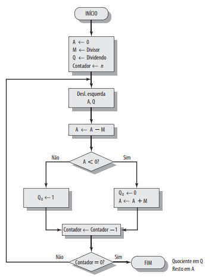

# SIAS 

SIAS é a abreviação para Simulador do IAS. O IAS foi previamente discutido em meu outro projeto [J](https://github.com/SapoGitHub/Repositorio-Geral/tree/master/J).

Apesar do nome, realizemos algumas adaptações conforme pareceram necessárias ou nosso conhecimento for limitado acerca dos detalhes de algum processo. O conteúdo é totalmente baseado no livro de Arquitetura e Organização de Computadores do  William Stallings, 8ª edição.

Primeiramente, foi implementado um ciclo de busca baseado no seguinte fluxograma:

Então começamos a implementar as 21 instruções originais:

Sempre respeitando a estrutura do computador proposta em:

Para a operação de adição, nos baseamos no seguinte diagrama:

Isso implica por exemplo, em 2 registradores e um FLAG (um registrador que indica o estado da CPU) dentro do módulo. Da mesma forma, para multiplicação utilizamos o Algoritmo de Booth, o que exige 4 registradores.

Essa abordagem foi utilizada pensando na didática de tais algoritmos.

E por fim, utilizamos a divisão inspirado no seguinte fluxograma:

Mas com as seguinte adaptações:
1. Guardamos os bits mais significativos de Q e M em um registrador QM.
2. Se o divisor ou dividendo for negativo, pegamos o complemento do mesmo.
3. Realizamos toda a divisão normalmente com inteiros positivos.
4. Atribuimos os sinais (fazemos o complemento se necessário) do quociente e resto de acordo com a seguinte regra:
	- sinal(resto)=sinal(dividendo).
	- sinal(quociente)=sinal(dividendo) x sinal(divisor).

## Observações

- Foi considerado que o registrador PC possui acesso um hardware próprio que lhe fornece capacidade de realizar uma soma binária do tipo <code>+1</code> sem acessar a ULA.
- Da mesma forma dentro do complementador no módulo de adição e subtração, ele possui a mesma capacidade de realizar a soma <code>+1</code>.
- O circuito da ULA desloca o binário em AC sem utilizar nenhum outro registrador.
- Os detalhes de como funciona a conexão entre as estruturas foi ignorado.
- Estamos interpretando "Próxima instrução está no IBR?" como "O conteúdo no IBR é diferente de 00000000000000000000?". Por isso quando o IBR passa os valores pro IR e MAR, estamos zerando ele.
	- Uma opção é comparar se os valores atuais do IBR, IR e MAR são diferentes, nesse caso nossa condição poderia ser reescrita como "Os valores do IR e MAR são diferentes do IBR?".
	- Essa abordagem é mais próxima da utilizada no [IAS Simulator](http://www.ic.unicamp.br/~edson/disciplinas/mc404/2017-2s/abef/IAS-sim/)
- Todas operações são apenas de inteiros, mas com sinal. Temos 1 bit pra indicar o sinal e 39 para magnitude.

## Melhorias possíveis:
- Tratar o argumento das funções aritméticas dentro da função, e não antes/depois.
- Tratar todas as instruções como funções.
	- Muitos trechos podem ser reaproveitados.
- Adicionar fluxogramas para as outras funções.
- Melhorar a conexão entre as imagens secundárias.
- Desenhar novas imagens para as outras instruções.
- Destacar quando algum circuito está sendo usado na imagem principal.
- Fechar quando clicar no x.
	- Atualmente sai usando a tecla ESC.
- Detalhar o tipo de instrução quando soma ou subtrai (ex.: ADD M(X) ou ADD |M(X)|).
- Explicitar como o componente para pegar a negação dentro da operação de adição, pode ser usado em outras operações e sua saída além de ir pro somador, pode ir para o AC.
- Da mesma forma que o item anterior, o componente que realiza o deslocamento para a multiplicação, pode ser reutilizado para as funções LSH e RSH.
- A parte de divisão foi implementado somente na interface gráfica.
	- Corrigir o fluxograma da divisão.
